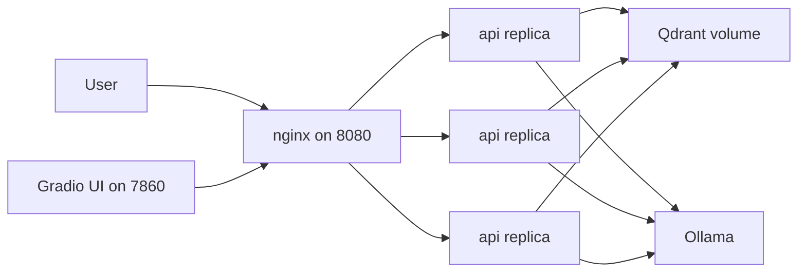

# Deployment



## Production Compose

Review `.env.prod.example`, or copy it to `.env.prod` for your own overrides. Generate a local TLS
certificate for the UI before starting, then run:

```bash
make certs
docker compose -f docker-compose.prod.yml up --build --scale api=3
```

The UI is published on `https://localhost:7860` (self-signed certificate), and the API is available through nginx on `http://localhost:8080`. The API service has no published host port, so traffic flows through nginx. nginx access logs include `upstream_addr`, which makes replica distribution visible when scaled.

### TLS for the UI (microphone access)

Browsers only expose `getUserMedia` (microphone capture) on a secure context: `localhost` is exempt, but any other hostname or IP is not. `make certs` (via `scripts/generate_certs.sh`) writes a `certs/cert.pem` / `certs/key.pem` pair; the `ui` service mounts `./certs` read-only into `/app/certs`, and `app/ui/gradio_app.py` automatically switches `demo.launch()` to HTTPS on the same port when both files are present. Regenerate the certificate before it expires, or provide your own certificate/key pair at those paths — for example a real certificate from an internal CA — if the UI is reachable from other machines under a stable hostname. Override the paths with `GRADIO_SSL_CERTFILE` / `GRADIO_SSL_KEYFILE` if you keep them elsewhere.

By default (no [mkcert](https://github.com/FiloSottile/mkcert) installed) this is a plain self-signed certificate valid 365 days, SAN `localhost` / `127.0.0.1`, and browsers will show a "connection is not private" warning you have to click through once. If `mkcert` is installed and `mkcert -install` has been run once (adds its local CA to the system/browser trust stores), `make certs` uses it instead and issues a certificate the browser already trusts — no warning.

## Stateless API Tier

The API tier is stateless. Request state lives only for the lifetime of a call. Durable state lives in the Qdrant named volume, and model artefacts live in container or host caches such as `HF_HOME=/models`. Because the API is stateless, horizontal scaling is done with replicas rather than increasing `UVICORN_WORKERS` inside one container.

## Scaling Story

ASR and embedding are CPU-bound in this demo, so additional API replicas can improve concurrent throughput. The LLM is the shared bottleneck when generation is enabled. The next scaling step would be a GPU node running vLLM, plus request queueing for async transcription and long-running note generation.

## Load Test Results

Run:

```bash
python scripts/load_test.py --url http://localhost:8080 --requests 20 --concurrency 1 --no-generate
python scripts/load_test.py --url http://localhost:8080 --requests 60 --concurrency 3 --no-generate
```

Generated results are written to `eval/results/load_results.md`.

## Security Notes

Containers run as a non-root `app` user. Secrets are not baked into images. The API service is internal-only in production compose, and nginx is the published entrypoint. Kubernetes secret manifests are examples only and contain no real secret values.

## Kubernetes

The manifests in `k8s/` are illustrative:

```bash
kubectl apply --dry-run=client -f k8s/
```

Qdrant is shown as a simple StatefulSet with a PVC. Production should use the official Helm chart or managed Qdrant. API pods use liveness and readiness probes, resource requests and limits, three replicas, and a rolling update strategy with `maxUnavailable: 0`.

## Next Steps

Use managed Qdrant or sharding for larger corpora, autoscale on queue depth, add canary deploys, and move generated note jobs to an async worker when audio duration grows.
