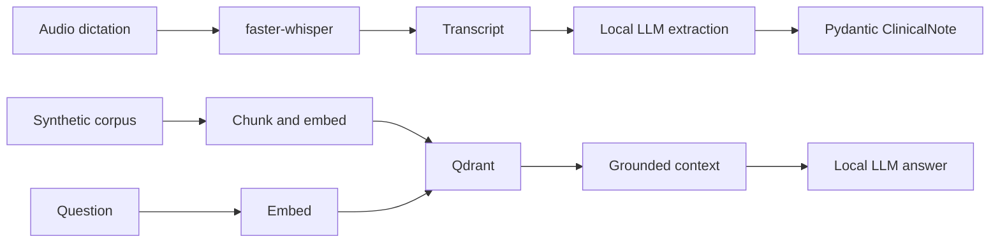

# Clinical Voice Note Assistant

Clinical Voice Note Assistant is a local engineering demo for clinical documentation workflows. Clinical documentation burden matters because free-text notes are slow to produce and hard to reuse safely, while structured data can support clearer handover, audit, retrieval, and downstream engineering evaluation. This demo transcribes spoken dictation, structures notes, and retrieves grounded reference snippets from a small bilingual corpus, all without paid APIs.

Synthetic data only, not a medical device, not medical advice, demo for engineering evaluation.



## Phase Status

Implemented phases include scaffold, configuration, synthetic reference corpus, chunking, ingestion, Qdrant retrieval, ASR utilities, schema extraction, grounded RAG, FastAPI endpoints, Gradio UI, ASR evaluation, retrieval evaluation, CI, and local compose. Deployment and production scaling files are added in the final phase.

## What You Can Run Now

The current working version supports the retrieval foundation:

- Load configuration from environment variables.
- Chunk the synthetic bilingual corpus.
- Embed chunks and upsert them into Qdrant.
- Ask a question from the CLI and receive scored source chunks.
- Run fast tests for configuration and chunking.

The production deployment stack is added in the final phase.

## Prerequisites

Use the existing `medscribe` conda environment for Python commands. You have two equivalent ways to do that.

Option A, run one command inside the environment without activating it:

```bash
conda run -n medscribe python --version
```

Option B, activate the environment once, then use normal commands:

```bash
conda activate medscribe
python --version
```

Why: the project needs the packages installed in `medscribe`. In this shell, plain `python` points to the base conda environment unless `medscribe` is activated. `conda run -n medscribe ...` is just a safe explicit form for docs and automation.

Install the Phase 1 dependencies:

```bash
conda run -n medscribe python -m pip install -e ".[dev]"
```

Why: editable install makes local package imports work while you develop, and the `dev` extra installs the test and lint tools.

You also need a running Qdrant service for ingestion and retrieval. If Docker is available, this is the simplest local command:

```bash
docker compose up qdrant
```

Why: Qdrant stores the embedded corpus chunks and returns the nearest chunks for each question. Without it, the CLI will fail with a clear connection message.

## Quick Start

Steps 1 through 8 below can be run in one shot with:

```bash
make run
```

Why: `scripts/start.sh` chains the manual steps together: it checks the `medscribe` conda
environment exists, installs dependencies, starts Qdrant and waits for it to be ready, generates a
self-signed TLS certificate for the UI if one is not already present, ingests the synthetic corpus,
checks whether Ollama is reachable (warning but not failing if it isn't), starts the API in the
background, waits for it to become healthy, then runs the Gradio UI in the foreground. Press
Ctrl+C to stop both the UI and the API. Set `SKIP_INSTALL=1` to skip the dependency install step,
and override `API_PORT` or `GRADIO_SERVER_PORT` if the defaults (`8000` and `7860`) are taken.

The step-by-step walkthrough below is still useful for understanding what each stage does, or for
running a single stage on its own (for example, re-ingesting the corpus after editing `data/corpus`).

## Step By Step Execution

### 1. Confirm the environment

Without activating the environment:

```bash
conda run -n medscribe python --version
```

Or, after `conda activate medscribe`:

```bash
python --version
```

Expected result: Python 3.11.

Why: the project is pinned to Python 3.11, matching the runtime target for local use, CI, and containers.

### 2. Install dependencies

```bash
conda run -n medscribe python -m pip install -e ".[dev]"
```

Or, after `conda activate medscribe`:

```bash
python -m pip install -e ".[dev]"
```

Expected result: pip installs the app package plus pinned dependencies from `pyproject.toml`.

Why: the retrieval code imports the local `app` package, `pydantic-settings`, `qdrant-client`, `typer`, `PyYAML`, and test tooling.

### 3. Run the fast checks

```bash
conda run -n medscribe python -m pytest -m "not integration"
conda run -n medscribe python -m ruff check .
```

Or, after `conda activate medscribe`:

```bash
python -m pytest -m "not integration"
python -m ruff check .
```

Expected result: all tests pass and ruff reports no lint errors.

Why: this verifies the config defaults, environment overrides, chunking behaviour, paragraph-aware chunking, overlap handling, and basic code quality before you touch external services.

### 4. Start Qdrant

In a separate terminal:

```bash
docker compose up qdrant
```

Expected result: Qdrant listens on `http://localhost:6333`.

Why: ingestion writes vectors into Qdrant, and retrieval reads from the same collection. The app degrades gracefully if Qdrant is unavailable, but search cannot run without a vector store.

### 5. Ingest the synthetic corpus

```bash
conda run -n medscribe make ingest
```

Or, after `conda activate medscribe`:

```bash
make ingest
```

Expected result: JSON output with the number of documents, chunks, collection name, and timing values.

Why: this reads the 10 synthetic markdown documents, chunks them, embeds each chunk, creates the configured Qdrant collection if needed, and upserts payloads containing `doc_id`, `title`, `chunk_index`, `text`, and `language`.

### 6. Ask a retrieval question

```bash
conda run -n medscribe make ask QUESTION="Welche erste Therapie ist bei Hypertonie beschrieben?"
```

Or, after `conda activate medscribe`:

```bash
make ask QUESTION="Welche erste Therapie ist bei Hypertonie beschrieben?"
```

Expected result: scored chunks from the synthetic corpus, followed by retrieval timings.

Why: this confirms the local retrieval loop works end to end: question embedding, Qdrant vector search, score threshold filtering, and citation-style chunk display. Add `--no-generate` when calling the CLI directly if you want retrieval-only output without an LLM call.

### 7. Pull or choose an Ollama model

The default model is:

```bash
ollama pull mistral:7b
```

If you already have another local model, override it:

```bash
LLM_MODEL=mistral:7b conda run -n medscribe python -m app.cli structure data/audio/scripts/05_en_followup.txt
```

Why: note structuring and generated answers use Ollama through its OpenAI-compatible endpoint. Retrieval-only paths do not need the LLM.

### 8. Run the API or UI

```bash
conda run -n medscribe make api
conda run -n medscribe make ui
```

Why: the API exposes pipeline endpoints for integration, while the Gradio UI gives a local demo surface for dictation, grounded questions, and evaluation tables.

If you will open the UI from anywhere other than `http://localhost`, generate a local TLS
certificate first:

```bash
conda run -n medscribe make certs
conda run -n medscribe make ui
```

Why: browsers only allow microphone access (`getUserMedia`) on a secure context. `localhost` is
treated as secure automatically, but any other hostname or LAN/IP address needs HTTPS or the
microphone source in the UI will fail to record. `make certs` (via `scripts/generate_certs.sh`)
writes `certs/cert.pem` and `certs/key.pem`; `app/ui/gradio_app.py` picks them up automatically and
switches the Gradio server to HTTPS on the same port.

By default this is a plain self-signed certificate, so the browser will show a one-time "connection
is not private" warning that you click through (Chrome: Advanced -> Proceed; Firefox: Advanced ->
Accept the Risk and Continue). To avoid that warning entirely, install
[mkcert](https://github.com/FiloSottile/mkcert) first (`sudo apt install mkcert` on
Debian/Ubuntu, `brew install mkcert` on macOS), then run `mkcert -install` once to add its local CA
to your system/browser trust stores. `make certs` detects mkcert automatically and issues a
certificate your browser already trusts, no warning at all.

### 9. Record the five clips

Read each file in `data/audio/scripts` aloud on a phone, save as wav, mp3, or m4a, and place each recording in `data/audio/recordings` with the same filename stem. For example, the recording for `01_de_hypertonie.txt` can be `01_de_hypertonie.m4a`.

Why: `eval_asr.py` pairs recordings to references by filename stem, so matching names let the WER and CER evaluation run without extra metadata.

### 10. Run evaluation

```bash
conda run -n medscribe make eval
```

Why: ASR evaluation writes WER and CER tables, while retrieval evaluation writes hit@1, hit@3, hit@5, MRR, and refusal correctness.

## Configuration

Defaults are defined in `.env.example` and can be overridden with environment variables:

```bash
QDRANT_URL=http://localhost:6333
QDRANT_COLLECTION=clinical_corpus
EMBEDDING_MODEL=BAAI/bge-m3
CHUNK_SIZE_TOKENS=500
CHUNK_OVERLAP_TOKENS=80
TOP_K=5
SCORE_THRESHOLD=0.35
```

Why: explicit environment variables make the demo portable across local shells, CI, Docker, and future deployment targets.

## Troubleshooting

If ingestion or search prints `Qdrant is unavailable at http://localhost:6333`, start Qdrant and rerun the command.

If ingestion prints `sentence-transformers is not installed in this environment`, install the project dependencies inside `medscribe`:

```bash
conda run -n medscribe python -m pip install -e ".[dev]"
```

Or, after `conda activate medscribe`:

```bash
python -m pip install -e ".[dev]"
```

Why: Qdrant may be running correctly, but embedding still needs the local `sentence-transformers` package and its model dependencies.

If dependency installation is slow, it is usually because `sentence-transformers` and its model stack are being installed or loaded.

If the first ingest is slow, that is expected. The embedding model may need to download and cache locally before vectors can be created.

If `/health/ready` returns 503, read the component body. It reports Qdrant, LLM, and embedding model readiness separately.

If `make ui` reports that port `7860` is already in use, either stop the existing UI process or choose another port:

```bash
GRADIO_SERVER_PORT=7861 make ui
```

If the microphone option in the "Dictation to Note" tab is greyed out or recording silently fails, the page is almost certainly being loaded over plain HTTP from a non-`localhost` address. Run `make certs` once, then restart the UI so it serves HTTPS (see step 8), and open the `https://` URL.

If transcription fails with `Library libcublas.so.12 is not found or cannot be loaded`, you have an NVIDIA GPU that faster-whisper auto-selected, but the CUDA 12 runtime libraries it needs are missing (the torch wheels ship CUDA 13, which does not satisfy ctranslate2). Install the GPU extra into the environment and restart the API/UI:

```bash
conda run -n medscribe python -m pip install -e ".[gpu]"
```

Why: the `gpu` extra installs the `nvidia-cublas-cu12` and `nvidia-cudnn-cu12` wheels, and the transcriber preloads them automatically before loading the Whisper model. Alternatively, set `WHISPER_DEVICE=cpu` to skip the GPU entirely.

## Current Results

ASR results:

<!-- ASR_RESULTS_START -->
# ASR Results

No recordings found in `data/audio/recordings`.
<!-- ASR_RESULTS_END -->

Retrieval results:

<!-- RETRIEVAL_RESULTS_START -->
# Retrieval Results

Retrieval evaluation was not run because Qdrant is unavailable.

Reason: `Qdrant is unavailable at http://localhost:6333: [Errno 111] Connection refused`
<!-- RETRIEVAL_RESULTS_END -->

## Production Demo

Review `.env.prod.example`, generate a local TLS certificate for the UI, then run:

```bash
make certs
docker compose -f docker-compose.prod.yml up --build --scale api=3
```

Why: this starts Qdrant, three stateless API replicas behind nginx, and the Gradio UI pointed at nginx. Ollama is available behind an optional compose profile, but host installation is typical on macOS. The `ui` service mounts `./certs` and serves HTTPS on `7860` whenever `certs/cert.pem` and `certs/key.pem` exist, which is required for microphone access from any host other than `localhost`.

## Developer Notes

Keep using the `medscribe` conda environment:

```bash
conda run -n medscribe python -m pytest -m "not integration"
conda run -n medscribe python -m ruff check .
```

If you already ran `conda activate medscribe`, the shorter form is fine:

```bash
python -m pytest -m "not integration"
python -m ruff check .
```

Why: these are the minimum checks before committing changes in this phase. The important part is the active environment, not the spelling of the command.
